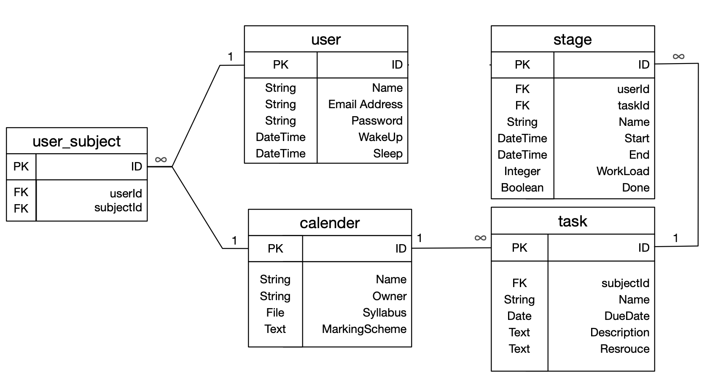

# Project Proposal
* Name (PennKey): siminghe
* Project Name: ScheduleInTouch
# Description
This project ScheduleInTouch aims at developing a website that makes task scheduling more convenient and efficient. It would allow users to join or create calendars, tasks of the calendar, and stages/checkpoint of the task. Then, time blocks will be automatically assigned to the user’s schedule. I wish users could manage their time more clearly with less effort. I will use an example to illustrate the website. Tom has many courses and is very frustrated at managing the various tasks. Hence, he tries to create calendars for his courses. He firstly creates a public calendar for CIS 196. Followed the syllabus, he easily added tasks of CIS 196. One of the tasks is the Final Project which is due on December 20, 2020. Tom divides the Final Project into two stages. The first stage is from November 20 to December 5. In this stage, Tom would spend 40 hours to finish the backend of the project. After the creation of this stage, the calendar would assign 40 hours to time blocks throughout the period so that Tom can follow the calendar and finish all works. The time blocks are after Tom wakes up and before Tom goes to sleep. If Tom adds a stage but there is not enough time block, the calendar will warn Tom. Now, if Jerry also wants to schedule his CIS 196 course, Jerry could join the calendar and get the tasks in the calendar. Then, Jerry could create his stages for each task and generate his customized schedule. 
# Database Schema

# Third Party Utilities
* Gem(s): 
  * bcrypt: password encryption
  * Devise
  * formtastic: create beautiful nested form
* API(s): 
  * Google Calendar API: calendar for scheduling
# Success Criteria
* Model
  1. has_many to has_many relationships: Users and Calendars
  2. Nested structure: Calendar and task; user and stage
  3. Google Calendar API
* Controller
  1. User and Password
  2. Upload Syllabus File
  3. Use formatatic to create beautiful nested forms for calendar, task, stage creation
* View
  1. Use Bootstrap and CSS
  2. Aesthetic
* Deployment
  1. Deploy to Heroku
  2. Private Gitlab repository

# Build Plan
* Nov 23 – Nov 29	Gitlab repository, Creation of all models, Set up associations and validations
* Nov 30 – Dec 6	Implement MVC
* Dec 7 – Dec 14	Implement Google Calendar API, Prettify the project

# Extra:
- Use kramdown to create markdown format of text
- Allows both public and private calendar
- Assign time blocks based on preference and priority TODO matrix.
- Implement Time Tracker and Analysis
- Emailing daily /weekly task report

